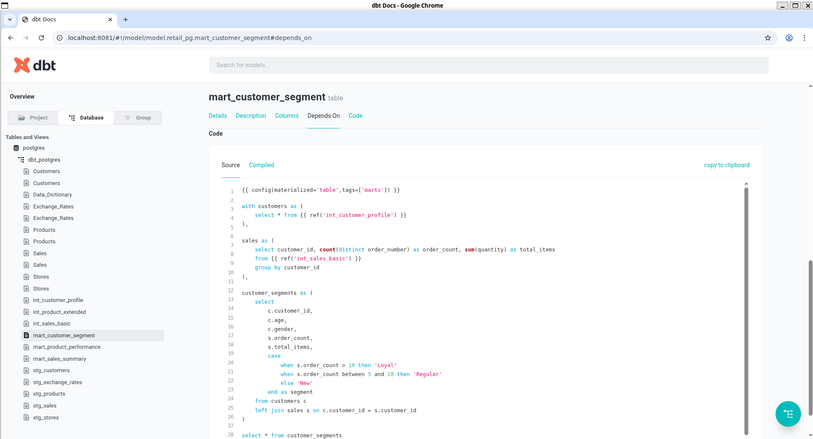
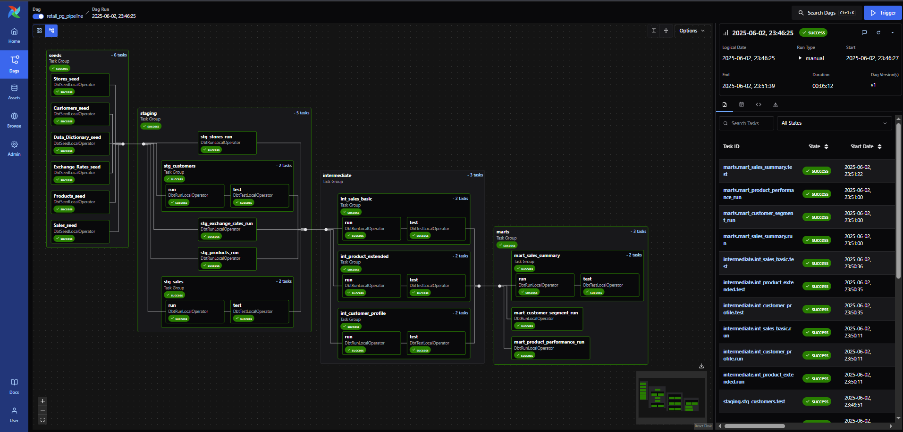

# 🛠️ DBT Retail PG – Postgres + Supabase + Airflow Project

This repository provides a complete setup for working with **DBT (Data Build Tool)** using a **Postgres** database hosted on **Supabase**, with automation handled by **Apache Airflow** and **Cosmos**.

---

## 📁 Project Structure

```
dbt-supabase-postgres/
├── airflow_retail_pg/        # Airflow project (DAGs, configs)
├── logs/                     # Logs directory (Airflow runtime)
├── retail_pg/                # DBT project folder
├── venv/                     # Python virtual environment (excluded by .gitignore)
├── .env                      # Environment variables (not committed)
├── .env-sample               # Sample .env file (edit and rename to .env)
├── .gitignore
├── LICENSE
├── README.md
└── requirements.txt          # Python dependencies
```

---

## ⚙️ Setup Instructions (Ubuntu)

1. **Clone the repository:**

```bash
git clone https://github.com/tunguyenn99/dbt-supabase-postgres.git
cd dbt-supabase-postgres
```

2. **Create Python virtual environment:**

```bash
python3 -m venv venv
source venv/bin/activate
```

3. **Install dependencies:**

```bash
pip install -r requirements.txt
```

4. **Prepare environment variables:**

- Copy the sample file and update credentials:

```bash
cp .env-sample .env
# Then edit .env with your Supabase/Postgres credentials
```

5. **Navigate to the DBT project folder:**

```bash
cd retail_pg
```

After that, create the following folders if not already available:

```
retail_pg/
│
├── models/                     # SQL models for data transformation
│   ├── staging/                # Normalize raw source data
│   ├── intermediate/           # Join and transform staging models
│   ├── marts/                  # Final models for reporting
│   └── schema.yml              # Metadata and tests
│
├── seeds/                      # Sample/reference data
│   ├── csv_files/              # Source CSV files (not committed)
├── macros/                     # Custom reusable SQL functions
├── snapshots/                  # Table change tracking
├── analyses/                   # Temporary analysis queries
├── tests/                      # Custom tests
├── dbt_project.yml             # Main DBT config
├── profiles.yml                # DB connection config
└── README.md                   # Project guide
```

6. **Run DBT commands:**

- Debug connection:
  ```bash
  dbt debug
  ```
- Run models:
  ```bash
  dbt run
  ```
- Test models:
  ```bash
  dbt test
  ```
- Generate docs:
  ```bash
  dbt docs generate
  dbt docs serve --port 8081
  ```

Below is a successful generation of `dbt docs`:




---

## 🔄 Automating with Airflow + Cosmos

Thanks to detailed instructions in below references sections to set up Airflow + Cosmos, I can configure Cosmos DAGs, and run scheduled DBT pipelines.

### ✅ Sample DAG Execution Result

Below is a successful run of the DBT pipeline DAG:



---

## 📚 References
- [DBT Documentation](https://docs.getdbt.com/)
- [Supabase Docs](https://supabase.com/docs)
- [Apache Airflow Docs](https://airflow.apache.org/docs/)
- [Astronomer Cosmos](https://astronomer.io/docs/cosmos)
